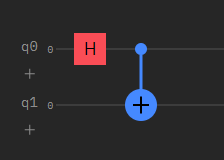
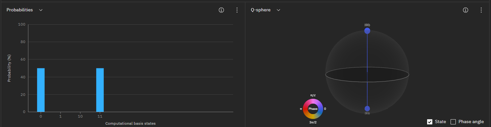
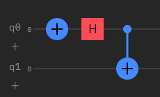
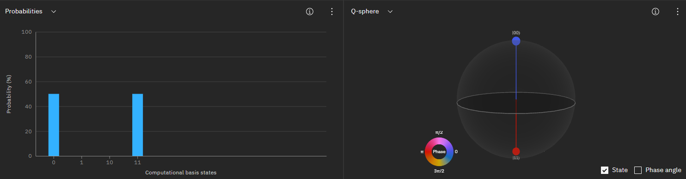
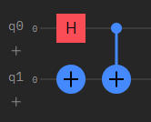
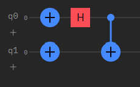

# Entanglement Gates
Using QASM to define quantum entanglement gates.

Bells state gate implementation:

1. Phi-Plus:

Circuit implementation:

State visualization:

Circuit implementation:

State visualization:

Circuit implementation:

State visualization:

Circuit implementation:

State visualization:

