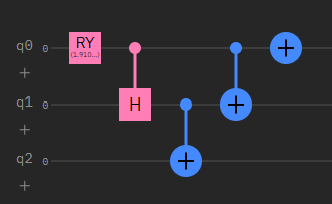
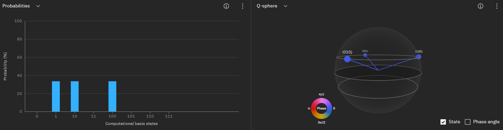

# Entanglement Gates
Using QASM to define quantum entanglement gates.

## Bells state gate implementation:

### Phi-Plus

Circuit implementation:

State visualization:

### Phi-Minus

Circuit implementation:

State visualization:

### Psi-Plus

Circuit implementation:

State visualization:

### Psi-Minus

Circuit implementation:

State visualization:

## Wofgang Duer State (W-State)

Circuit implementation:

State visualization:

